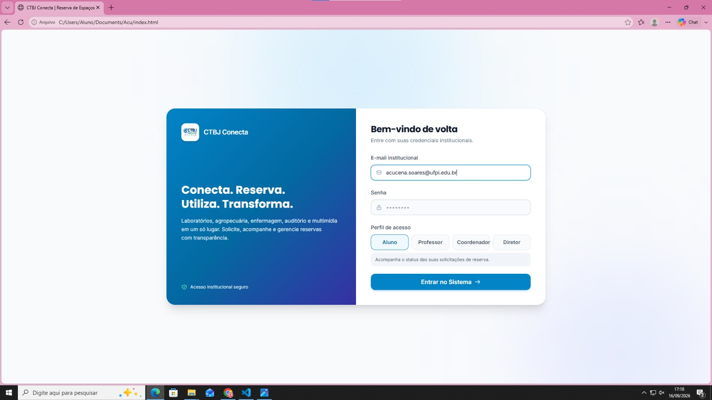

# Relatório de Testes e Validação - CTBJ Conecta

## 1. Evidências da Interface de Usuário

### Tela de Login

### Painel do Aluno (Solicitação de Reservas)

### Painel do Coordenador/Diretor

### Painel do Professor

## 2. Validações Realizadas
- [x] Ajuste da paleta de cores para os tons oficiais da logo (Azul, Verde e Roxo).
- [x] Inclusão dos laboratórios reais (Informática, Agropecuária, Enfermagem, Auditório).
- [x] Controle de acesso por perfil (Aluno solicita, Diretor, Coordenador, Professor aprova ou recusa).
